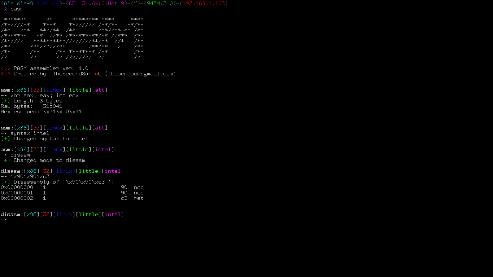

# PASM     


PASM is a simple, multi-purpose assembler and disassembler for Linux. It leverages from Rasm2 functionalities and wraps them into a colorful, user-friendly CLI. Extremely useful during shellcode development and heavy Assembly coding.

<p align="center">

</p>

## Table of Contents
- [Installation](#installation)
- [Features](#features)
- [Usage](#usage)
- [License](#license)


## Installation
Go to the cloned repository and run `setup.py`:
`$ python setup.py install`
It will install all needed dependencies.
**WARNING:** If you have different package manager than *apt-get*, you will have to install *radare2* manually.
Then launch PASM from your terminal:
`$ python2.7 pasm.py`

## Features
- Support for over 40 architectures
- Easily configurable 
- Clear minimalistic output
- Power and versatility of Rasm2 wrapped into custom interface
- Null-bytes and bad characters warning

## Usage
#### Assembly and disassembly
In order to switch between assembly and disassembly modes, simply run `asm` or `disasm` command. Then enter the instructions or opcodes you want to assembly (or disassembly):

```
asm:[x86][32][linux][little][att]
-➤ disasm
[+] Changed mode to disasm
disasm:[x86][32][linux][little][att]
-➤ 9090c3
[+] Disassembly of '9090c3 ':
0x00000000   1                       90  nop
0x00000001   1                       90  nop
0x00000002   1                       c3  retl


disasm:[x86][32][linux][little][att]
-➤ \x90\x90\xc3
[+] Disassembly of '\x90\x90\xc3 ':
0x00000000   1                       90  nop
0x00000001   1                       90  nop
0x00000002   1                       c3  retl
```


#### Command prompt

The prompt of PASM is divided into 5 differrent sections:


>mode:[architecture][number_of_bits][os][endianess][assembly_syntax]<br/>->

Each section presents us with current assembler option. Every option can be changed from the CLI:


>asm:[x86][32][linux][little][att]
-> os linux<br/>[+] Changed OS to linux

#### Configuration file
To change default settings of PASM (used at startup), edit`config.ini`:
>[assembler]<br/>bits = 32<br/>endian = little<br/>os = linux<br/>syntax = att<br/>arch = x86<br/>starting_mode = asm


## License
This software is under [MIT License](https://en.wikipedia.org/wiki/MIT_License)